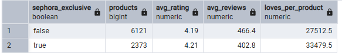
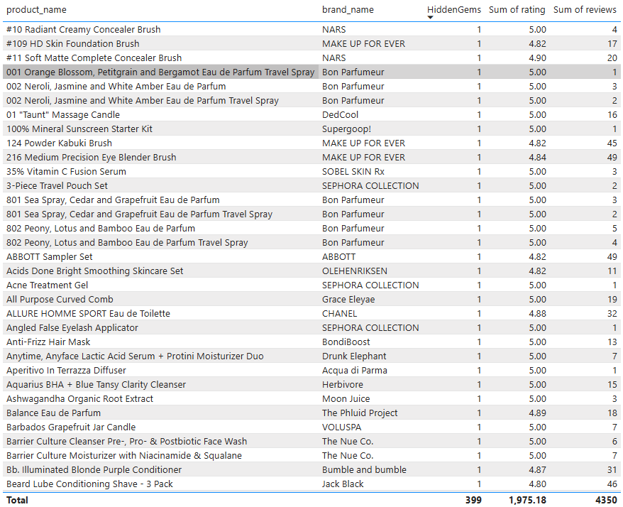
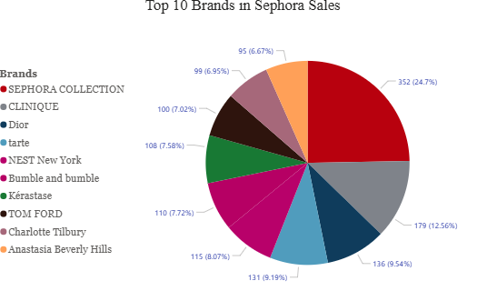
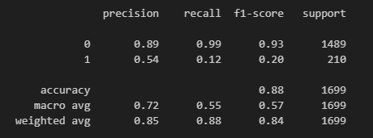
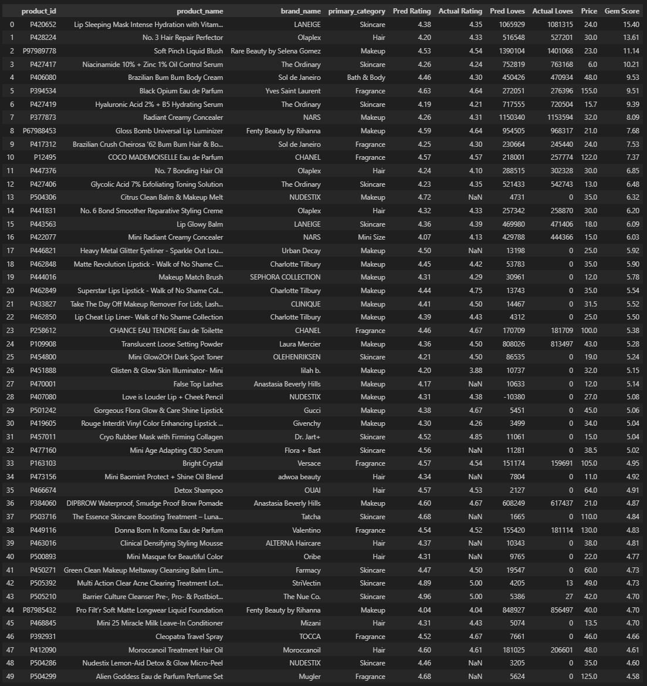

# Sephora Product Business & ML Analysis  

**A business sales analysis and application of ML of online Sephora products by taking raw data into an actionable business insight.**


---
## Data Attributes
   - Product ID
   - Product Name
   - Brand ID
   - Brand Name
   - Loves Count
   - Rating
   - Reviews
   - Size
   - Variation Type
   - Variation Value
   - Variation Desc
   - Ingredients
   - Price USD
   - Value Price USD
   - Sale Price USD
   - Limited Edition
   - New
   - Online Only
   - Out of Stock
   - Sephora Exclusive
   - Highlights
   - Primary Category
   - Secondary category
   - Tertiary Category
   - Child Count
   - Child Max price
   - Child Min price
---


---

## 📊 Business Intelligence

### 🔹 Some sample business insights

1. **Do Sephora-exclusive products excel in sales compared to external products?**

   - Yes! On average, the Sephora-exclusive products receive higher ratings and more hearts per product.  
   - This result shows a positive sign for Sephora’s marketing strategy.  

   

---

2. **What are some "hidden gem" products that need to be promoted for advertisements?**

   - High rating items that received many hearts but only had few reviews.  

   

---

3. **A pie chart representing the proportion of the top 10 brands in Sephora**

   

---


## 🤖 Machine Learning

### 🔹 Hidden Gem Predictor Model   |   Supervised Classification

**This model can be potentially useful when determining which items will have a marketing value**

1. **Label Creation (`hidden_gem`)**
   - A product is labeled as **1 (hidden gem)** if:  
     - Rating ≥ 4.4 (good quality)  
     - Number of reviews < 50 (low visibility)  
   - Otherwise, it’s **0 (not hidden gem)**.  
   → This turns your dataset into a **binary classification problem**.

---

2. **Features Used (No Direct Leakage)**
   - To avoid the model simply memorizing the label definition, we do **not include `rating` or `reviews` as features**.  
   - Instead, we use **proxy variables** that capture product popularity and brand/category effects indirectly:  
     - **Numeric:** `price_usd`, `sale_price_usd`, `loves_count`  
     - **Categorical:** `brand_name`, `primary_category`  
   - These features allow the model to learn correlations between product characteristics, engagement, and hidden gem potential without directly repeating the label rule.

---


3. **Why Excluding `rating` and `reviews` Matters**
   - If we fed `rating` or `reviews` into the model, it would trivially rediscover the hidden gem rule and give artificially high performance (data leakage).  
   - By using **indirect signals (price, discount, hearts, brand, category)**, the model instead generalizes patterns of what *type of product tends to become a hidden gem*.  
   - This makes the model useful for **new products without many reviews**, where the hidden gem label cannot be computed directly.
---

4. **Model**
   - `XGBClassifier` (gradient boosting decision trees).  
   - Handles nonlinear interactions between numeric and categorical features well.  
   - Example patterns it can learn:
     - Certain brands consistently produce high-rated products.  
     - Products with many “loves” but low discount → higher likelihood of being hidden gems.  
     - Categories like “Fragrance” vs “Skincare” may differ in visibility.

---

5. **Train/Test Split**

   
     

   - 80% training, 20% test datasets.
   - The model predicts 89% True negatives, 99% false negatives, 54% true positives and 12% false positives correctly.
   
      **We have significantly low performance on true hidden gems because of the imbalance of data. Only ~12% of the data are hidden gems data**
---

### 🔹 Popularity Predictor Model   |   Supervised Regression + Composite Ranking  

**This model is useful for estimating whether a new product will gain popularity**

---

1. **Target Definition (`gem_score`)**
   - Instead of a binary label, we define a **statistical score** that captures the hidden gem concept:  
     - **High predicted quality** → product should have a strong rating.  
     - **Low actual traction** → fewer loves/reviews than expected.  
   - Formula (category-normalized z-scores):  
     ```
     gem_score = 1.2 * z(predicted_rating) 
               + 0.8 * (z(predicted_loves) - z(actual_loves)) 

     ```
   → Products with higher `gem_score` are surfaced as **potential gems**.

---

2. **Features Used**
   - To generate predictions, we train **two regressors**:  
     - **Rating Regressor** → predicts expected rating from product attributes.  
     - **Popularity Regressor** → predicts expected loves_count (popularity).  
   - Features include:  
     - **Numeric:** `price_usd`, `sale_price_usd`, `value_price_usd`, `child_min_price`, `child_max_price`, `child_count`  
     - **Categorical:** `brand_name`, `primary_category`, `secondary_category`  
     - **Text:** `ingredients` (vectorized with TF-IDF)  

---

3. **Model**
   - Base regressors: `XGBRegressor` (gradient boosting decision trees).  
   - Handles both numerical and categorical interactions effectively.  
   - The two regression outputs (`pred_rating`, `pred_loves`) are blended with actual traction to compute `gem_score`.  

---

4. **Results**
   - The output is a ranked DataFrame of products, sorted by `gem_score`.  
   - Example columns include:  
     - Predicted rating vs. actual rating.  
     - Predicted loves vs. actual loves.  
     - Price and adjusted gem score.  
   - The **Top 50** products with the highest scores are highlighted as candidates for **marketing focus and promotional campaigns**.
  
     

---
