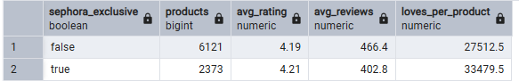
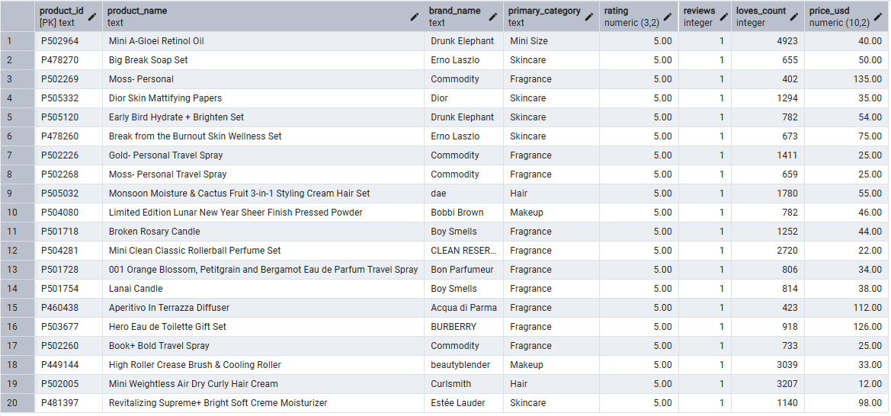

# sephora-sql-bi
A BI analysis on online Sephora products by taking raw data into an actionable business insight.

Some sample business insights:

1. Do Sephora-exclusive products excel in sales compared to external products?

   Yes! On average, the Sephora-exclusive products receive higher ratings and more hearts per product.

2. What are some "hidden gem" products that need to be promoted for advertisements?

   20 Items were listed which received a high rating and numerous hearts but had few to no reviews.

